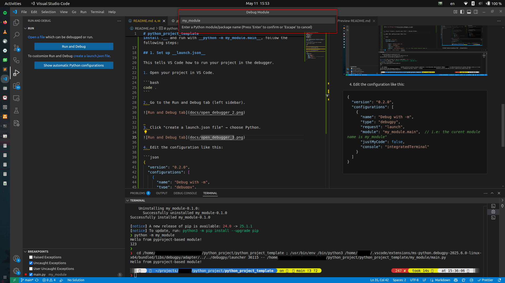

# python_project_template

In this tutorial, we have the following files:

```plain
python_project_template/
├── my_module/
│   ├── __init__.py
|   ├── __main__.py
│   └── main.py
├── pyproject.toml
└── .vscode/
    └── launch.json
```

In order to debug a Python project in VS Code that we install via __pip install .__ and run with __python -m my_module.main__, follow the following steps:

## Set up __launch.json__

This tells VS Code how to run your project in the debugger.

1. Open your project in VS Code.

```bash
code .
```

2. Go to the Run and Debug tab (left sidebar).


3. Click "create a launch.json file" → Configure Python Debugger.

Create launch.json


Pick Python Debugger


Pick Module


Enter Module name


4. Edit the _.vscode/launch.json_ like this, if Step 3 fails:

```json
{
  // Use IntelliSense to learn about possible attributes.
  // Hover to view descriptions of existing attributes.
  // For more information, visit: https://go.microsoft.com/fwlink/?linkid=830387
  "version": "0.2.0",
  "configurations": [
    {
      "name": "Python Debugger: Module",
      "type": "debugpy",
      "request": "launch",
      "module": "my_module"
    }
  ]
}
```

## Set breakpoints and run debugger

Set Breakpoints


Run with debugger


Result
